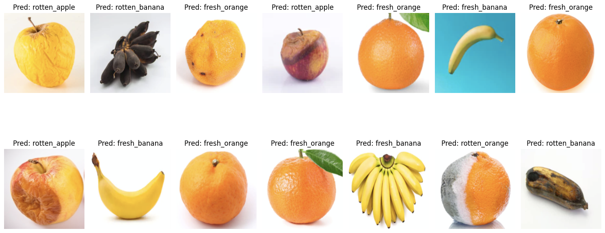

#  Kaggle Fruit Classification

##  Project Goal

The goal of this project is to **classify images of fresh vs. rotten fruits** using a Convolutional Neural Network (CNN) implemented in **PyTorch**.
This project was developed as part of a series of Computer Vision courses taught by **Antonio Rueda-Toicen**.

---

##  Project Content

This repository contains the following Jupyter notebook:

`Fruit_classification_Kaggle_Competition.ipynb`  
 → Trains and evaluates a CNN model for multi-class fruit classification.


---

##  Dataset

The dataset used for this project is the **Fruit classification** dataset from Kaggle.
It contains labeled images of fruits belonging to **six categories**:

- `fresh_apple`
- `fresh_banana`
- `fresh_orange`
- `rotten_apple`
- `rotten_banana`
- `rotten_orange`

Each class contains images taken under varied lighting and backgrounds, simulating real-world conditions.

---

## Model Performance

- Test Accuracy: **93.1%**,
- Leaderbord : **14**,   check [Leaderboard ](https://www.kaggle.com/competitions/fruit-classification/leaderboard)
- Model: Convolutional Neural Network (CNN) built with **PyTorch**


---

## Visual Results

Sample prediction results from the CNN model:



---


##  Requirements

If you're running the notebook on **Kaggle**, the required libraries are already pre-installed:

- numpy  
- pandas  
- matplotlib  
- Pytorch
- PIL
- scikit-learn  

To run locally, you can install the dependencies using:

```bash
pip install -r requirements.txt
```

## Contact

Author: Hala Temmami
